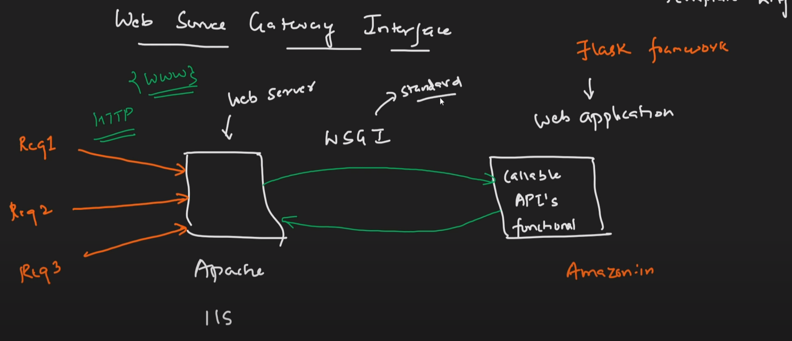
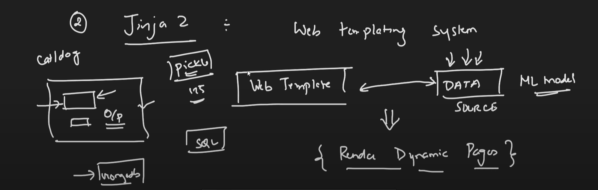

# Flask Tutorial By Krish Naik

- Flask is a web application framework written in python.
- Used to develope web applications, web APIs and creating machine learning applications.
- Developed by **Armin Ronacher** and associated with the Poco group of Python enthusiasts.
- Flask is based on the WSGI (Web Server Gateway Interface) protocol, which facilitates communication between web servers and web applications.
- The use of WSGI allows web servers to interact with Flask applications and execute callable functions or APIs.
- Flask utilizes the Jinja2 template engine, a popular Python templating system, to combine web templates with data sources.
- The primary goal of Jinja2 is to render dynamic web pages by integrating templates with data sources.
- Flask is suitable for developing end-to-end projects, including web applications, web APIs, and even machine learning applications.
- Flask is known for its simplicity and ease of use, making it a favorite among Python developers.
- Flask is often compared to other web frameworks like Django, with both serving different use cases within web development.
- Flask allows for rapid development and is known for its minimalistic approach, giving developers the flexibility to choose their preferred tools and libraries.





## Installation

- Install Anaconda. We will use conda to create a virtual environment. And it provides a lot of packages that we can use in our project.
- Create a virtual environment using conda. We will use this virtual environment to install flask and other packages.

```bash
# Run this in anaconda prompt
# Create a virtual environment
conda create -n flask-tutorial python=3.8

# Activate the virtual environment
conda activate flask-tutorial

# Install flask
pip install flask
# Install flask using conda
conda install flask
# or
conda install -c anaconda flask

# Open VS Code
code .
```

**or** run only -

```bash
pip install -r requirements.txt

# if fail on wheel install
python -m pip install --upgrade pip setuptools wheel
```

### Create first flask app

```python
# app.py
from flask import Flask

app = Flask(__name__)

@app.route('/')
def hello():
    return "Hello World!"

if __name__ == '__main__':
    app.run(debug=True)
```

```bash
# Run the app
python app.py

# Open the browser and go to http://127.0.0.1:5000/
```

## Tutorial

1. [1. Sample Flask App](1.%20Sample%20Flask%20App/)
2. [2. Student App](2.%20Student%20App/)
3. [3. Student App with Templates](3.%20Student%20App%20with%20Templates/)
4. [4. Student App with Templates Part 2](4.%20Student%20App%20with%20Templates%20Part%202/)
5. [5. Student App Adding HTML CSS](5.%20Student%20App%20Adding%20HTML%20CSS/)

## Codes
1. Static Files and Request Object - [Code](codes-4/) | [Docs](docs/codes-4.md)
2. Video Streaming Using Webcam - [Code](codes-5/) | [Docs](docs/codes-5.md)
3. OpenCV Face and Eye Detection - [Code](codes-6/) | [Docs](docs/codes-6.md)
4. Face Recognition Using Webcam - [Code](codes-7/) | [Docs](docs/codes-7.md)


