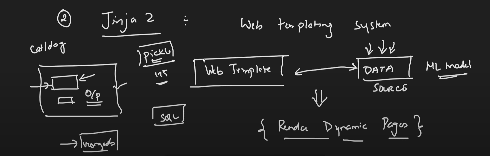

# Flask Tutorial

## Intro to Flask (WSGI, Jinja2)

- It is a web application framework written in python.
- You can create end to end projects.
- Developed by **Armin Ronacher**. He is also the creator of **Jinja2** template engine. And also runs a blog called **The Pocoo Project**.
- Flask is based on **Werkzeug WSGI toolkit** and **Jinja2 template engine**.
- WSGI: Web Server Gateway Interface. It is a specification that describes how a web server communicates with web applications, and how web applications can be chained together to process one request.


- Jinja2: Web template engine for python. It is inspired by **Django**'s templating system. It's main aim to render templates with data from python objects.



## Installation

- Install Anaconda. We will use conda to create a virtual environment. And it provides a lot of packages that we can use in our project.
- Create a virtual environment using conda. We will use this virtual environment to install flask and other packages.

### Commands

```bash
# Create a virtual environment
conda create -n flask-tutorial python=3.8

# Activate the virtual environment
conda activate flask-tutorial

# Install flask
pip install flask

# Install flask using conda
conda install flask
# or
conda install -c anaconda flask
```

**or** run only -

```bash
pip install -r requirements.txt
```

## Tutorial

1. Routing and App Structure - [Code](codes-1/) | [Docs](docs/codes-1.md)
2. Binding URL Dynamically and Variable Rules - [Code](codes-2/) | [Docs](docs/codes-2.md)
3. Templates and HTTP Methods - [Code](codes-3/) | [Docs](docs/codes-3.md)
4. Static Files and Request Object - [Code](codes-4/) | [Docs](docs/codes-4.md)
5. Video Streaming Using Webcam - [Code](codes-5/) | [Docs](docs/codes-5.md)
6. OpenCV Face and Eye Detection - [Code](codes-6/) | [Docs](docs/codes-6.md)
7. Face Recognition Using Webcam - [Code](codes-7/) | [Docs](docs/codes-7.md)


